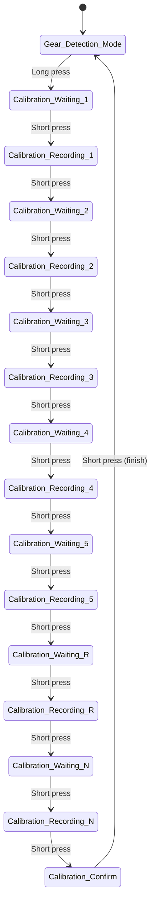

# Gear Calibration Manual for Arduino System

This manual explains how to calibrate the gear detection system using a single button.

---

## Normal Operation: Gear Detection Mode

This is the default mode when you power on the system.

- The system automatically detects which gear you're in.
- **Short press:** no effect
- **Long press (hold > 3 seconds):** enter calibration mode

---

## Calibration Mode

Calibration is done with **one button** using short and long presses.

### Button Actions in Calibration Mode

| Action        | What to Do                          | Result                                |
|---------------|-------------------------------------|----------------------------------------|
| Short press   | Quick tap (< 3 seconds)             | Advance to the next step               |
| Long press    | Hold for more than 3 seconds        | Abort calibration and return to gear detection mode |

---

## Calibration Flow

You will record the system position for each gear in the order:
**1 → 2 → 3 → 4 → 5 → R → N**

At each step:

1. System waits for you to move the gear into position
2. Short press to **start recording**
3. Short press again to **stop recording**
4. System moves to the next gear

After finishing all gears, the system will enter a **calibration confirmation step**, then return to gear detection mode.

---

## State Machine

---

## Aborting Calibration

You can **abort the calibration process at any time** by holding the button for more than 3 seconds (long press).

This will:
- Discard all recorded gear data
- Return you to normal gear detection mode

Aborting is safe and can be done **in any calibration step** — even during a recording.

---

## Summary

- Start in **Gear Detection Mode**
- Long press → enter **Calibration Mode**
- Short press → step through gears (record → stop → next)
- Final short press → confirm and save
- Long press anytime → **abort** and return to Gear Detection Mode
