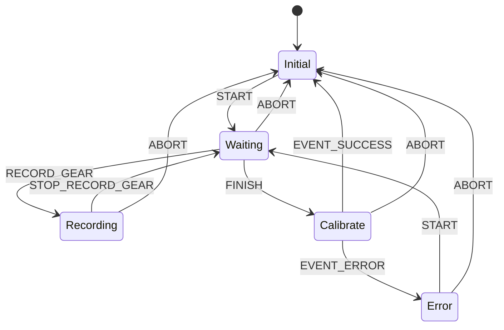

# Calibration State Machine

This state machine defines the process of calibrating sensor values for gear detection. It consists of **two types of state transitions**:

1. **Command-Triggered Transitions** – Initiated by external commands (e.g., from a laptop via Serial).
2. **Event-Triggered Transitions** – Automatically triggered by the calibration process itself.

## **📌 State Machine Overview**

## **🎯 Command-Triggered State Transitions**
| **Command**        | **Current State** | **Next State**       | **Description** |
|--------------------|-------------------|----------------------|-----------------|
| `START`            | `Initial`         | `Waiting`            | Begin calibration. |
| `RECORD_GEAR X`.   | `Waiting`         | `Recording`          | Start recording sensor values for gear `X`. |
| `STOP_RECORD_GEAR` | `Recording`       | `Waiting`            | Stop recording for the current gear. |
| `FINISH`           | `Waiting`         | `Calibrate`          | Start evaluating recorded data. |
| `ABORT`            | _(Any active state)_ | `Initial`         | Reset system.   |

## **📌 Event-Triggered State Transitions**
| **Event**          | **Triggered By**  | **From State**  | **To State**  | **Description** |
|--------------------|-----------------|---------------|-------------|----------------|
| `EVENT_SUCCESS`    | Calibration passes validation | `Calibrate` | `Initial` | Calibration is successful, reset system. |
| `EVENT_ERROR`      | Overlapping sensor values detected | `Calibrate` | `Error` | Calibration failed, requires retry. |

## **🔧 How Calibration Works**
1. **Start Calibration (`START`)** → Moves to `Waiting`.
2. **Record Each Gear (`RECORD_GEAR X`)** → Transitions to `Recording`.
3. **Stop Recording (`STOP_RECORD_GEAR`)** → Moves back to `Waiting`.
4. **Finish Calibration (`FINISH`)** → Moves to `Calibrate`, where the system validates recorded values.
5. **If values are valid (`EVENT_SUCCESS`)**, the system resets.
6. **If values overlap (`EVENT_ERROR`)**, the system moves to `Error`, where the user can restart (`START`) or abort (`ABORT`).
