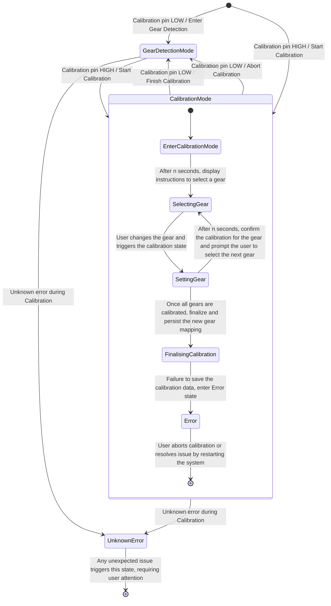

# Gear Detection and Calibration State Machine

## Introduction

This document describes the state machine design for gear detection and calibration modes of an Arduino-based gear display system. The system uses either hall sensors or gyroscopes to detect gears and supports an integrated calibration mode where the user can calibrate the system.

The state machine ensures clear transitions between different modes, handles errors, and defines how the calibration data is saved persistently across restarts.

## State Machine Overview

The system operates in two main modes: **Gear Detection Mode** and **Calibration Mode**. These modes are controlled by a dedicated pin input. When the pin is LOW, the system enters **Gear Detection Mode**; when the pin is HIGH, it enters **Calibration Mode**.

Additionally, there is an **Error state** to handle issues during the calibration process, such as failure to save data or unknown errors.

### State Machine Diagram

### State Descriptions

#### 1. **GearDetectionMode**
   - This is the normal operational mode where the system reads the sensor values and maps them to the corresponding gear.
   - If a mapping error occurs, the system defaults to a predefined state (e.g., Neutral) and continues operation without requiring manual intervention.

#### 2. **CalibrationMode**
   - Entered when the calibration pin is HIGH. The system allows the user to calibrate each gear.
   - Each gear is selected sequentially, and the system reads the sensor values to map them to a corresponding gear.
   - Once calibration is complete, the data is saved to the EEPROM for persistence. If the save fails, the system enters the **Error** state.

#### 3. **Error State**
   - This state is triggered if there’s a failure during the calibration process, such as the system being unable to save the calibrated values.
   - The error could be due to an issue with EEPROM writing or other unforeseen circumstances.
   - In the event of a failure, the user can restart calibration or abort the process and revert to **GearDetectionMode** with the previous gear mapping.

#### 4. **UnknownError State**
   - This state is triggered for any unexpected or unknown errors in the system.
   - The system displays an error message to the user, indicating that something went wrong, and asks them to restart or troubleshoot.

---

## Features and Guidance

### User Guidance and Visual Feedback

- **Calibration Feedback**: During calibration, the system will use visual cues (e.g., blinking LEDs or on-screen messages) to guide the user. For example, when the system is waiting for a gear to be selected, an LED may blink until the gear is shifted.
- **Error Handling**: If a failure occurs during calibration (e.g., failure to save data), the system should provide clear feedback to the user (e.g., a steady red LED or error message) indicating that the calibration process has failed.
- **Unknown Errors**: If an unknown error occurs, the system will enter the **UnknownError** state, display an error message, and prompt the user to restart the system.

### Error Handling and Memory Considerations

- **EEPROM for Persistence**: Calibration data will be stored in the EEPROM, which ensures that the data persists across power cycles. The EEPROM has a limited write cycle (typically 100,000 writes), so care must be taken not to write excessively.
- **Fallback on Failure**: If calibration fails, the system will discard the new calibration data and revert to the previously saved mapping to ensure reliable gear detection.
- **Sufficient Memory**: The system has been designed to ensure enough memory is available for two gear mappings, each supporting 10 gears. This includes Neutral (N) and Reverse (R) gears, ensuring sufficient room for operational needs.

---

## Conclusion

This document outlines the state machine for the gear detection and calibration system. By clearly defining states, transitions, and error handling mechanisms, the system ensures robustness and user-friendliness. The complementary use of EEPROM for persistent data storage ensures that calibration data remains available after restarts. In case of errors, the system provides fallback mechanisms to maintain operation continuity.
